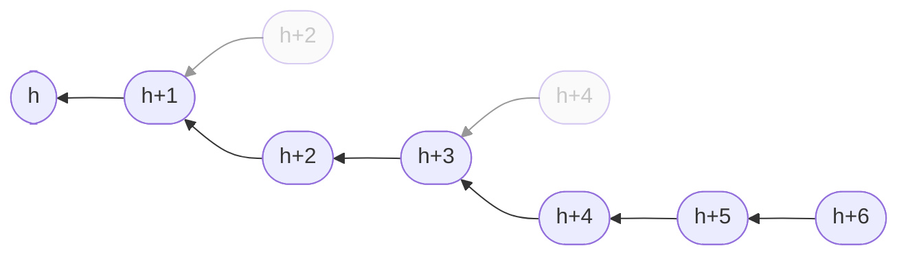
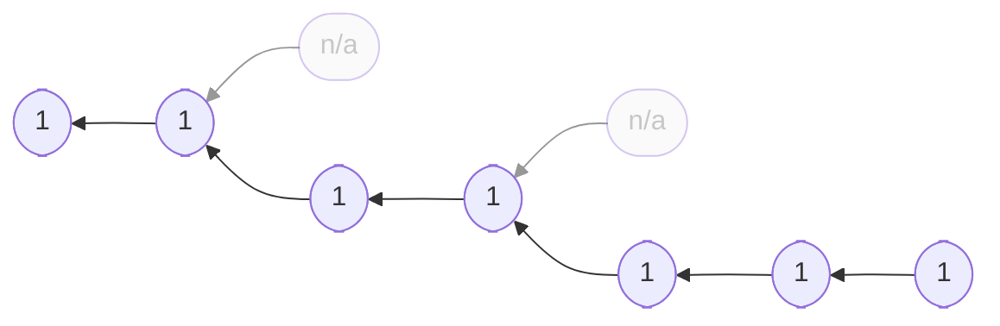

## Intuition

The "original" proof-of-work consensus protocol. Miners build a linear
chain of blocks (blockchain). Each block refers to exactly one parent
block by including the parents hash. Appending a new block requires a
proof-of-work. Miners always try to extend the longest chain. The number
of predecessors of a block is called *height*.


## Example



Boxes represent blocks, arrows represent hash-references. Each block has
exactly one parent. Appending a new block requires proof-of-work. The
gray blocks are orphaned.


## Specification

Have a look at [the methodology page for protocol specification]() to learn how to read this.

### Blockchain

```python
def roots():
    return [Block(height=0, miner=None)]


def validity(b: Block):
    assert len(b.parents()) == 1
    assert b.has_pow()
    assert b.height == b.parents()[0].height + 1
    return True
```

### Node

```python
def init(roots: [Block]):
    return roots[0]


def update(old: Block, new: Block, event: string):
    if event == "mining":
        return Update(state=new, share=[new])
    elif new.height > old.height:
        return Update(state=new)
    else:
        return Update(state=old)


def mining(b: Block):
    return Block(height=b.height + 1, parents=[b], miner=Env.my_id)
```

### Difficulty Adjustment

```python
def progress(b: Block):
    return b.height
```

### Rewards

```python
def reward(b: Block):
    return [Reward(b.miner, 1)]
```



Reward scheme applied to the example blockchain shown above. Each block
on the longest chain assign 1 unit of reward to is miner.


<!--

## Attacks

### Selfish Mining

Description.

### SSZ attack space

Description.

## CPR API

How to simulate, attack, learn.

-->

## Literature

The following papers may serve as a starting point.

- Satoshi Nakamoto. Bitcoin: A peer-to-peer electronic cash system. Tech
report, 2008. [[bitcoin.org]](https://bitcoin.org/bitcoin.pdf)
- Juan Garay, Aggelos Kiayias, and Nikos Leonardos. The Bitcoin Backbone Protocol:
Analysis and Applications. Eurocrypt '15.
[[publisher]](https://link.springer.com/chapter/10.1007/978-3-662-46803-6_10)
- Dongning Guo and Ling Ren. Bitcoin’s Latency--Security Analysis Made
Simple. AFT '22. [[preprint]](https://arxiv.org/abs/2203.06357)
