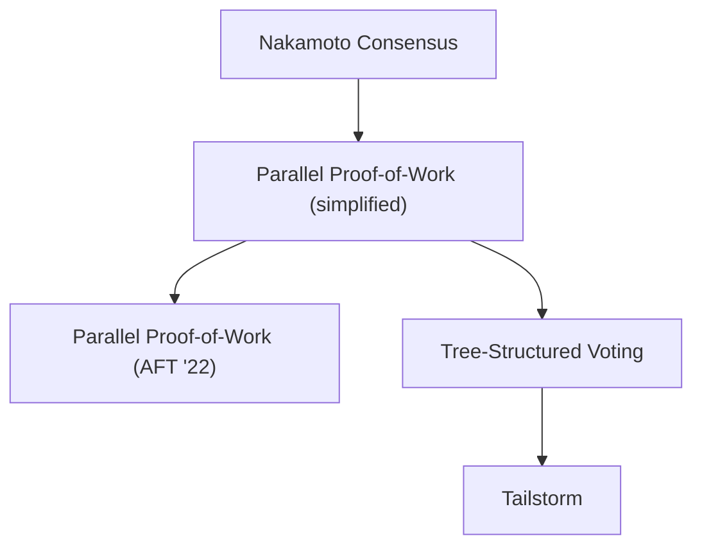

This sections contains a number of protocol specifications. One page per
specification. Each specification starts with a short intuition section,
briefly describing how the protocol works, what it tries to solve, and
how it relates to others. It follows the specification itself, written
out as a Python program. These programs are meant for human consumption.
Read them to understand them. Do not copy them into an interpreter. The
[protocol specification methodology page]()
get's you going.

If you want to study the protocols in-order, we recommend following the
dependency graph below. If you just read the
[obligatory methodology section](),
you've learned about [Nakamoto consensus](../nakamoto) along the lines.
You are ready for [parallel voting](../parallel-simple).



Suggested order for studying the specified protocols.
Click on a node to jump to the protocol specification page!

