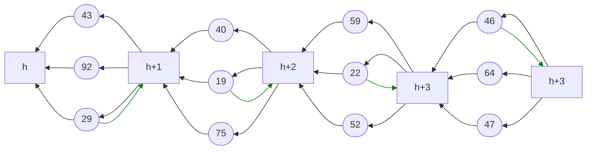
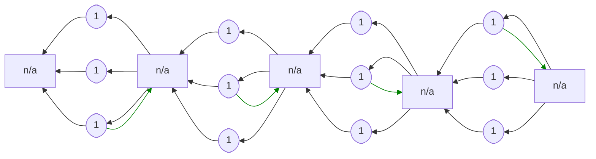

## Intuition

Relative to the [simplified version](../parallel-simple), this protocol
saves one proof-of-work per block. Unlike in the simplified version,
blocks do not require a proof-of-work. Only the votes are mined. The
protocol restricts appending new blocks to temporally elected leaders.
The leader is the miner who contributes the smallest vote, where size
refers to the hash of the vote.

Leadership is verified using cryptographic signatures. Miners include
their public key in each vote. When they become leader, they sign the
proposed block with the private key belonging to the public key in the
smallest vote. The other nodes check the signature and thereby verify
leadership.

It is worth noting, that this use of cryptographic signatures does not
rely on a public key infrastructure (PKI). Key-pairs are associated not
with protocol participants but with votes. In fact, each vote could
include a unique public key.

## Example



Parallel proof-of-work with three votes per block. Blocks have square
boxes and are labelled with their height. Votes have round boxes and are
labelled with their hash. Only votes require a proof-of-work. Blocks are
signed by the voter with the smallest hash, which we indicate using
green arrows.

## Specification

### Parameters

`k`: number of votes per block

### Blockchain

```python
def roots():
    return [Block(height=0, miner=None, kind="block")]


def last_block(b: Block):
    assert b.kind == "block"
    return b.parents()[0].parents()[0]


def validity(b: Block):
    parents = b.parents()
    if b.kind == "block":
        p = last_block(b)
        assert len(parents) == k
        assert b.signed_by(parents[0].miner)
        assert b.height == p.height + 1
        for i in range(1, len(parents)):
            assert parents[i] == p
            assert parents[i - 1].hash() <= parents[i].hash()
    elif b.kind == "vote":
        assert len(parents) == 1
        assert b.has_pow()
    return False
```

### Node

```python
def init(roots: [Block]):
    return roots[0]


def preference(old: Block, new: Block):
    assert new.kind == "block"
    if new.height > old.height:
        return new
    if new.height < old.height:
        return old
    n_old = len(old.children())
    n_new = len(new.children())
    if n_new > n_old:
        return new
    if n_new < n_old:
        return old
    if new.children()[0].hash() < old.children()[0].hash():
        return new
    return old


def attempt_block(b: Block):
    assert b.kind == "block"
    votes = b.children().sort(key=lambda x: x.hash())
    while votes[0].miner != my_id:
        votes.pop(0)
    if len(votes) < k:
        return []  # block infeasible
    else:
        # select k votes; priotize own votes, then old before new;
        # maintain hash-ordering
        votes = ...
        return [
            Block(
                kind="block",
                height=b.height + 1,
                parents=votes,
                sign=True,
            )
        ]


def update(old: Block, new: Block, event: string):
    if new.kind == "block":
        return Update(
            state=preference(old, new),
            share=[new] if event == "append" else [],
        )
    else:  # new.kind == "vote"
        b = new.children()[0]
        return Update(
            state=preference(old, b),
            share=[new] if event == "mining" else [],
            append=attempt_block(b),
        )


def mining(b: Block):
    assert b.kind == "block"
    return Block(kind="vote", parents=[b], miner=my_id)
```

### Rewards

```python
def reward(b: Block):
    if b.kind == "vote":
        return [Reward(b.miner, 1)]
```


Blockchain depicted above with reward scheme applied.
Each proof-of-work rewards its miner with one unit of reward, hence only
votes assign a reward.

<!--

## Attacks

### Selfish Mining

Description.

### SSZ-like attack space

Description.

## CPR API

How to simulate, attack, learn.

-->

## Literature

In their presentation, Keller and Böhme refer to this protocol as
$\mathcal B_k$.

- Keller and Böhme. Parallel Proof-of-Work with Concrete Bounds.
AFT '22. [[preprint]](https://arxiv.org/abs/2204.00034)
