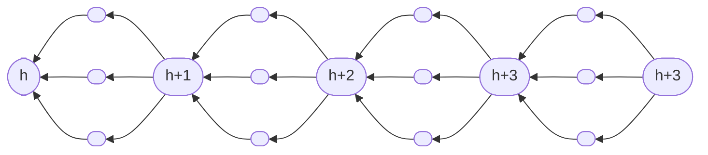
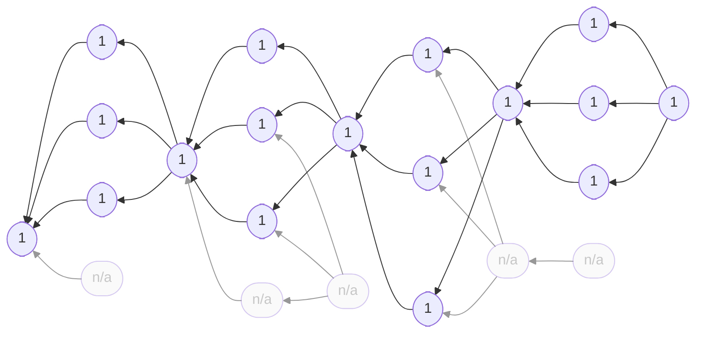

## Intuition

[Nakamoto consensus](../nakamoto) enforces a linear chain of blocks. Of
any two blocks with equal height, only one will be retained. The others
get orphaned. Network-level attackers can strategically time message
delivery such that the defenders produce more orphans. When the attacker
engages with the defenders in a race for the longest chain, orphans
effectively slow down the defender and the attacker becomes stronger.
Parallel proof-of-work minitages this problem by introducing parallelism
where Nakamoto's blockchain is strictly linear.

Parallel proof-of-work distinguishes between blocks and votes. The
blocks still form a linear chain, but the votes can be mined in
parallel. Votes for the same parent block are compatible, even if their
miners cannot communicate. Orphans can only happen at the transition
between blocks.

In this simple version of parallel proof-of-work, both blocks and votes
require a proof-of-work. Appending a new block requires $k - 1$ votes
for the previous block. Together with the proof-of-work required for the
block itself, this makes $k$ proofs-of-work per block.

The [original version of parallel proof-of-work](../parallel-aft22)---as
presented by Keller and Böhme at AFT '22---is a bit more complicated.
Make sure you understand this simple version before you explore the
AFT '22 version.

## Example





Parallel proof-of-work with three votes per block. Idealized case w/o
orphans. Blocks are labelled with their height. Votes have no label.
Both blocks and votes require a proof-of-work.





The same parallel proof-of-work blockchain with potential orphans in gray.


## Specification

Have a look at [the methodology page for protocol specification]() to learn how to read this.

### Parameters

`k`: number of proofs-of-work per block (or number of votes per
block plus one)

### Blockchain

```python
def roots():
    return [Block(height=0, miner=None, kind="block")]


def parent_block(b: Block):
    if b.kind == "block":
        return b.parents()[0].parents()[0]
    else:
        return b.parents()[0]


def validity(b: Block):
    assert b.has_pow()
    if b.kind == "block":
        p = parent_block(b)
        assert len(b.parents()) == k - 1
        assert b.height == p.height + 1
        for x in b.parents():
            assert x.parents()[0] == p
    elif b.kind == "vote":
        assert len(b.parents()) == 1
    return False
```

### Node

```python
def init(roots: [Block]):
    return roots[0]


def preference(old: Block, new: Block):
    assert new.kind == "block"
    if new.height > old.height:
        return new
    if new.height < old.height:
        return old
    n_old = len(old.children())
    n_new = len(new.children())
    if n_new > n_old:
        return new
    return old


def update(old: Block, new: Block, event: string):
    if new.kind == "block":
        consider = new
    else:
        consider = parent_block(new)
    return Update(
        state=preference(old, consider),
        share=[new] if event == "mining" else [],
    )


def mining(b: Block):
    assert b.kind == "block"
    if len(b.children()) < k - 1:
        return Block(kind="vote", parents=[b], miner=my_id)
    else:
        # select k - 1 votes; own votes first, then old before new
        votes = ...
        return Block(
            kind="block",
            height=b.height + 1,
            parents=votes,
            miner=my_id,
        )
```

### Difficulty Adjustment

```python
def progress(b: Block):
    if b.kind == "block":
        return b.height * k
    else:
        p = parent_block(b)
        return p.height * k + 1
```

### Rewards

```python
def local_tip(b: Block):
    return b


def global_tip(l: [Block]):
    b = l[0]
    for i in range(1, len(l)):
        b = preference(b, l[i])
    return b


def history(b: Block):
    h = [b]
    p = b.parents()
    while p != []:
        b = p[0]
        if b.kind == "block":
            h.append(b)
        p = b.parents()
    return h


def reward(b: Block):
    assert b.kind == "block"
    return [Reward(x.miner, 1) for x in [b] + b.parents()]
```





Blockchain depicted above with reward scheme applied to the longest chain.
Each proof-of-work rewards its miner with one unit of reward. Naturally,
orphans are not rewarded.


<!--

## Attacks

### Selfish Mining

Description.

### SSZ-like attack space

Description.

## CPR API

How to simulate, attack, learn.
-->

## Literature

This protocol is a simplified version of the protocol $\mathcal B_k$
presented by Keller and Böhme.

- Keller and Böhme. Parallel Proof-of-Work with Concrete Bounds.
AFT '22. [[preprint]](https://arxiv.org/abs/2204.00034)
