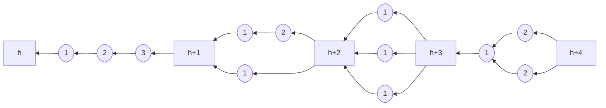
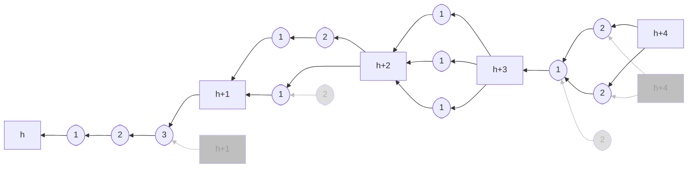
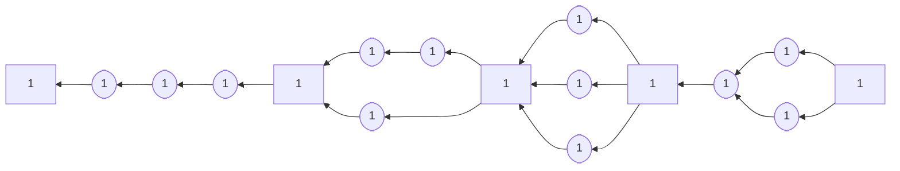
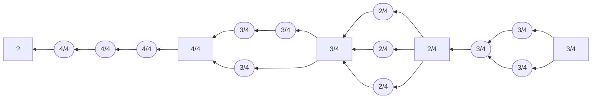
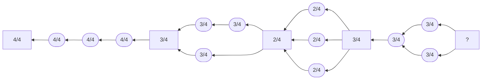
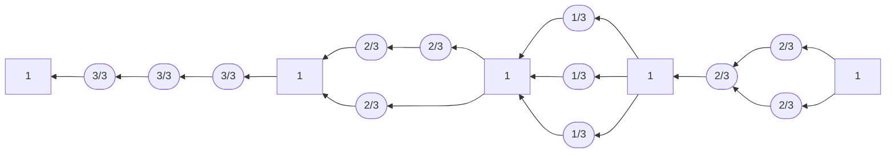
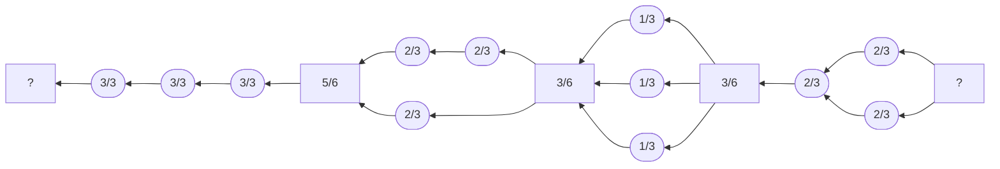

## Intuition

This protocol extends the [simplified version](../parallel-simple) of
parallel proof-of-work with tree-structured voting. We allow votes to
link back to other votes, where previously they could only link back to
blocks. This tree structure enables a new incentive scheme where
non-linearities are punished fairly.

The new protocol maintains parallel proof-of-work's core property: votes
which confirm the same parent block are compatible and can be used
together to build the next block. To be clear, tree-structured voting
does not change the parallel voting mechanism of the other two parallel
protocols, [simple](../parallel-simple) and [AFT '22](../parallel-aft22)
version.

In the new protocol, miners do not merely vote for the last block, but
they vote for the longest chain of votes. Optimally, all votes form a
linear chain and we know the exact order in they were mined. Otherwise,
the votes form a tree and the ordering of votes is partial.

Recall that ordering is the main objective of proof-of-work consensus
protocols. Tree-structured voting motivates forming a linear chain of
votes through incentives. The rewards for the votes in a block are scaled
down in proportion to the depth of the vote tree. Non-linearity implies
reduced reward.

Let's take a step back and recall [Nakamoto](../nakamoto)'s original
proof-of-work protocol. Also Nakamoto motivates linearity through
incentives. Blocks that to not end up on the linear blockchain are
orphaned and do not get rewards. In the intuition to the [simple
parallel protocol](../parallel-simple) we've seen that orphans are a
threat to security. But orphans also cause unfairness with respect to
honest behaviour. Imagine a situation where two miners---one weak (let's
say 2% of the hash-rate) and one strong (20% of the hash-rate)---mine
blocks around the same time and create a fork. Obviously, the weak miner
tries to confirm her block, the strong miner tries to confirm the other.
We do not know what the other miners (72% of the hash-rate) do. If we
assume that they are unbiased, that is, they mine one or the other block
with equal probability, we end up in a situation were 38% of the hash
rate tries to confirm the weak miners block and 62% of the hash rate
tries to confirm the strong miners block. Only one of the blocks will
end up in the final blockchain. The other does not get rewards. The
punishment mechanism for non-linearity is biased in favour of the strong
miner.

Tree-structured voting addresses this problem. Here, the reward is
discounted on a per-block basis. Non-linearity implies lower rewards but
the discount applies to all confirmed votes equally. The punishment bias
is removed, at least among the confirmed votes.

Tree-structured voting and the discounting of rewards were originally
proposed for the [Tailstorm](../tailstorm) protocol. However, since
Tailstorm also does elaborate optimizations, we think it is easier to
first study this protocol.

## Example



Tree-structured voting with 3 votes per block. Block have square boxes
and are labelled with their height, votes have round boxes and are
labelled with their depth. Both votes and blocks require a
proof-of-work.




Orphans are possible, but only when transitioning from one block to the
next. These transitions are less frequent if there are more votes per
block.


## Specification

### Parameters

`k`: number of proofs-of-work per blocks (or number of votes per block
plus one)

### Blockchain

```python
def roots():
    return [Block(height=0, miner=None, kind="block")]


def last_block(b: Block):
    b = b.parents()[0]
    while b.kind != "block":
        b = b.parents()[0]
    return b


def confirmed_votes(b: Block):
    set = {}
    for p in b.parents():
        if p.kind == "vote":
            set |= {p}
            set |= confirmed_votes(p)
    return set


def confirming_votes(b: Block):
    set = {}
    for c in b.children():
        if c.kind == "vote":
            set |= {c}
            set |= confirming_votes(c)
    return set


def validity(b: Block):
    assert b.has_pow()
    if b.kind == "block":
        assert b.height == last_block(b).height + 1
        assert b.depth == 0
        assert len(confirmed_votes(b)) == k - 1
        for x in confirmed_votes(b):
            assert last_block(x) == last_block(b)
    elif b.kind == "vote":
        parents = b.parents()
        assert len(parents) == 1
        assert b.depth == parents[0].depth + 1
    return False
```


### Node

```python
def init(roots: [Block]):
    assert len(roots) == 1
    return roots[0]


def preference(old: Block, new: Block):
    if new.kind != "block":
        new = last_block(new)
    if new.height > old.height:
        return new
    if new.height < old.height:
        return old
    old_votes = confirming_votes(old)
    new_votes = confirming_votes(new)
    if len(new_votes) > len(old_votes):
        return new
    if len(new_votes) < len(old_votes):
        return old
    old_depth = max([x.depth for x in old_votes])
    new_depth = max([x.depth for x in new_votes])
    if new_depth > old_depth:
        return new
    return old


def update(old: Block, new: Block, event: string):
    return Update(
        state=preference(old, new),
        share=[new] if event == "mining" else [],
    )


def mining(b: Block):
    vote_tree = confirming_votes(b)
    if len(vote_tree) < k - 1:
        # block infeasible; extend longest chain of votes
        opt = b
        for x in confirming_votes(b):
            if x.depth > opt.depth:
                opt = x
            if x.depth == opt.depth and opt.miner == my_id:
                opt = x
        return Block(
            kind="vote",
            depth=opt.depth + 1,
            parents=[opt],
            miner=my_id,
        )
    else:
        # block feasible
        # select leaves in vote_tree to confirm k - 1 votes
        # while maximizing depth
        leaves = ...
        return Block(
            kind="block",
            height=b.height + 1,
            depth=0,
            parents=leaves,
            miner=my_id,
        )
```

### Rewards

#### Constant reward

```python
def constant_reward(b: Block):
    return [Reward(b.miner, 1)]
```



Constant rewards make tree-structured voting equivalent to [simple
parallel proof-of-work](../parallel-simple).



#### Discount reward

A couple of variants are possible

```python
def discount0_reward(b: Block):
    if b.kind == "block":
        pows = {b} | confirmed_votes(b)
        d = max([x.depth for x in b.parents()])
        return [Reward(x.miner, (d + 1) / k) for x in pows]
```



Non-linearity is punished proportionally to the depth of the vote-tree.
A block counts as leave in the tree of confirmed votes. We do not see
the tree of the leftmost block, thus we cannot calculate its rewards.


```python
def discount1_reward(b: Block):
    if b.kind == "block":
        pows = confirmed_votes(b) | last_block(b)
        d = max([x.depth for x in b.parents()])
        return [Reward(x.miner, (d + 1) / k) for x in pows]
```



Again, non-linearity is punished proportionally to the depth of the vote-tree.
Now, a block counts as root in the tree of confirming votes. We do not see
the tree of the rightmost block, thus we cannot calculate its rewards.
Compared to the `discount0` scheme, only the blocks' rewards change.


```python
def discount2_reward(b: Block):
    if b.kind == "block":
        d = max([x.depth for x in b.parents()])
        return [Reward(b.miner, 1)] + [
            Reward(x.miner, d / k) for x in confirmed_votes(b)
        ]
```



Still, non-linearity is punished proportionally to the depth of the vote-tree.
Now, the depth-based discount applies to votes only while blocks get
constant rewards.


```python
def discount3_reward(b: Block):
    if b.kind == "block":
        d = max([x.depth for x in b.parents()])
        block_rewards = [
            Reward(b.miner, d / k / 2) for x in [b, last_block(b)]
        ]
        vote_rewards = [
            Reward(x.miner, d / k) for x in confirmed_votes(b)
        ]
        return block_rewards + vote_rewards
```



As before, non-linearity is punished proportionally to the depth of the
vote-tree. The depth-based discount applies to votes like in the
`discount2` scheme. Here, blocks do not get constant reward but the mean
of confirmed and confirming votes. We cannot calculate the rewards for
the outermost blocks because they depend on unobserved parts of the
blockchain.


Needless to say, other hybrids are possible. Tree-structured voting
opens up a whole design space for blockchain incentive schemes.

<!--

## Attacks

### Selfish Mining

Description.

### SSZ-like attack space

Description.

## CPR API

How to simulate, attack, learn.

-->

## Literature

Some sort of tree-structured voting in present in Bobtail, altough it
does not discount rewards depending on the tree structure. Alzayat et
al. model analyse the fairness of inequality problem in Bitcoin.

- George Bissias and Brian N. Levine. Bobtail: Improved Blockchain
Security with Low-Variance Mining. NDSS '22.
[[publisher]](https://www.ndss-symposium.org/ndss-paper/bobtail-improved-blockchain-security-with-low-variance-mining/)
- Mohamed Alzayat and others. Modeling Coordinated vs. P2P Mining: An Analysis of Inefficiency and
Inequality in Proof-of-Work Blockchains.
[[preprint]](https://arxiv.org/pdf/2106.02970.pdf)
