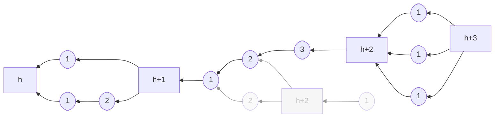
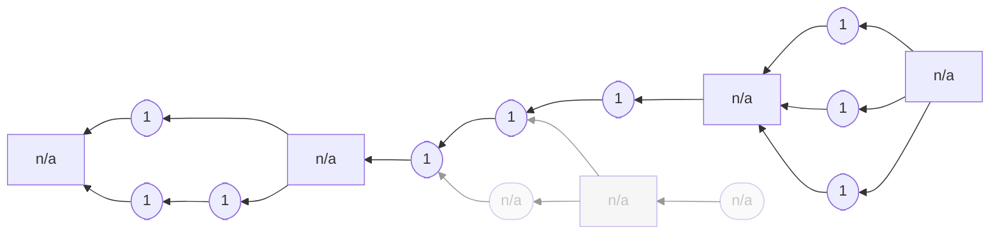

## Intuition

Tailstorm is an improved version of [tree-structured voting](../parallel-tree)
where the blocks that summarize finished rounds of voting do not require
a separate proof-of-work. Summaries can be computed deterministically
from the summarized votes. Nodes can re-produce summaries locally, hence
they do not have to be communicated over the (latent) network.

Tailstorm uses two kinds of blocks <<sub-blocks>> and <<summmaries>>.
Sub-blocks are what was called <<vote>> in [tree-structured
voting](../parallel-tree). Sub-blocks have exactly one parent and they
require a proof-of-work. Summaries conclude a round of voting by
accumulating $k$ sub-blocks that all confirm the same parent summary.
Summaries do not require a proof-of-work. They are computed
deterministically from the $k$ summarized sub-blocks.

Recall the different viable discount rewards schemes presented for
[tree-structured voting](../parallel-tree/#discount-reward). There, it was not
obvious how to reward the blocks between two rounds of voting. Here, in
Tailstorm, the solution is apparent. Summaries do not require additional
work, hence we do not hand out rewards for summaries. Sub-blocks are
treated like votes were treated before: the reward is scaled
proportionally to the depth of the sub-block tree.

## Example





Tailstorm with three sub-blocks per summary. Square boxes represent
summary blocks and round boxes represent sub-blocks. Only sub-blocks
require a proof-of-work. Summary blocks are labelled with their height,
sub-blocks with their depth. The gray blocks are orphaned.


## Specification

Have a look at [the methodology page for protocol specification]() to learn how to read this.

### Parameters

`k`: number of sub-blocks per summary-block

### Blockchain

```python
def roots():
    return [Block(height=0, depth=0, miner=None, kind="summary")]


def parent_summary(b: Block):
    b = b.parents()[0]
    while b.kind != "summary":
        b = b.parents()[0]
    return b


def confirmed_sub_blocks(b: Block):
    set = {}
    for p in b.parents():
        if p.kind == "sub-block":
            set |= {p}
            set |= confirmed_sub_blocks(p)
    return set


def confirming_sub_blocks(b: Block):
    set = {}
    for c in b.children():
        if c.kind == "sub-block":
            set |= {c}
            set |= confirming_sub_blocks(c)
    return set


def validity(b: Block):
    if b.kind == "summary":
        p = parent_summary(b)
        assert len(confirmed_sub_blocks(b)) == k
        assert b.height == p.height + 1
        assert b.depth == 0
        for x in confirmed_sub_blocks(b):
            assert parent_summary(x) == p
    elif b.kind == "sub-block":
        parents = b.parents()
        assert len(parents) == 1
        assert b.has_pow()
        assert b.depth == parents[0].depth + 1
    return False
```

### Node

```python
def init(roots: [Block]):
    return roots[0]


def preference(old: Block, new: Block):
    assert new.kind == "summary"
    if new.height > old.height:
        return new
    if new.height < old.height:
        return old
    n_old = len(confirming_sub_blocks(old))
    n_new = len(confirming_sub_blocks(new))
    if n_new > n_old:
        return new
    if n_new < n_old:
        return old
    r_old = my_reward(old)
    r_new = my_reward(new)
    if r_new > n_old:
        return new
    return old


def summarize(b: Block):
    assert b.kind == "summary"
    if len(confirming_sub_blocks(b)) < k:
        return []  # summary infeasible
    else:
        # Select leaves in sub-block tree such that the tree includes
        # k sub-blocks and own-reward is maximized.
        leaves = ...
        return [
            Block(
                kind="summary",
                height=b.height + 1,
                depth=0,
                parents=leaves,
            )
        ]


def update(old: Block, new: Block, event: string):
    if new.kind == "summary":
        return Update(state=preference(old, new))
    else:  # new.kind == "sub-block"
        p = parent_summary(new)
        return Update(
            state=preference(old, p),
            share=[new] if event == "mining" else [],
            append=attempt_summary(p),
        )


def mining(b: Block):
    best = b
    for sb in confirming_sub_blocks(b):
        if sb.depth > p.depth or (
            sb.depth == p.depth and p.miner == my_id
        ):
            best = sb
    return Block(
        kind="sub-block",
        depth=best.depth + 1,
        parents=[best],
        miner=my_id,
    )
```

### Difficulty Adjustment

```python
def progress(b: Block):
    return b.height * k + b.depth
```

### Rewards

```python
def local_tip(b: Block):
    return b


def global_tip(l: [Block]):
    b = l[0]
    for i in range(1, len(l)):
        b = preference(b, l[i])
    return b


def history(b: Block):
    h = [b]
    p = b.parents()
    while p != []:
        b = p[0]
        if b.kind == "summary":
            h.append(b)
        p = b.parents()
    return h
```

#### Constant reward

```python
def constant_reward(b: Block):
    assert b.kind == "summary"
    return [Reward(x.miner, 1) for x in confirmed_sub_blocks(b)]
```





Constant reward applied to the example blockchain shown above. Only the
miners of sub-blocks get assigned rewards.


#### Discount reward

```python
def discount_reward(b: Block):
    assert b.kind == "summary"
    r = max([x.depth for x in b.parents()]) / k
    return [Reward(x.miner, r) for x in confirmed_sub_blocks(b)]
```




Discount reward applied to the example blockchain shown above. Observe
how the reward scheme punishes non-linearity.


<!--

## Attacks

### Selfish Mining

Description.

### SSZ attack space

Description.

## CPR API

How to simulate, attack, learn.

-->
