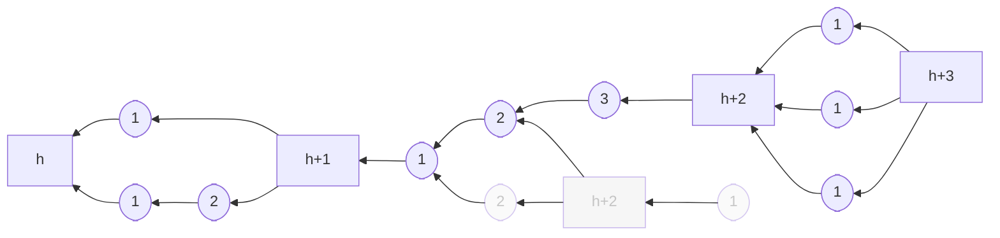
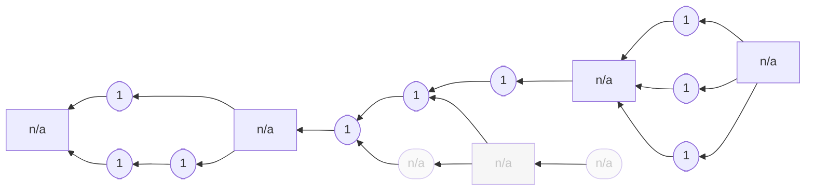
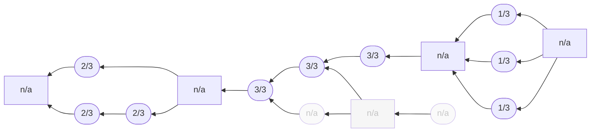

## Intuition

To be written. I'll do the easier protocols first.

## Example blockchain



Tailstorm with three sub-blocks per summary. Square boxes represent
summary blocks and round boxes represent sub-blocks. Only sub-blocks
require a proof-of-work. Summary blocks are labelled with their height,
sub-blocks with their depth. The gray blocks are orphaned.

## Specification

### Parameters

`k`: number of sub-blocks per summary-block

### DAG specification

```python
def roots():
    return [Block(height=0, miner=None, kind="summary")]


def last_summary(b: Block, include=True):
    if not include:
        b = b.parents()[0]
    while b.kind != "summary":
        b = b.parents()[0]
    return b


def sub_blocks(b: Block):
    set = {}
    for p in b.parents():
        if p.kind == "sub-block":
            set |= {p}
            set |= sub_blocks(p)
    return set


def validity(b: Block):
    if b.kind == "summary":
        s = last_summary(b)
        assert len(sub_blocks(b)) == k
        assert b.height == s.height + 1
        assert b.depth == 0
    else:  # b.kind == "sub-block"
        parents = b.parents()
        assert len(parents) == 1
        assert b.has_pow()
        assert b.depth == parents[0].depth + 1
    return True
```


### Node specification

```python
def init(roots: [Block]):
    return roots[0]


def confirming_sub_blocks(b: Block):
    set = {}
    for c in b.children():
        if c.kind == "sub-block":
            set |= {c}
            set |= confirming_sub_blocks(c)
    return set


def preference(old: Block, new: Block):
    assert new.kind == "summary"
    if new.height > old.height:
        return new
    if new.height < old.height:
        return old
    n_old = confirming_sub_blocks(old)
    n_new = confirming_sub_blocks(new)
    if n_new > n_old:
        return new
    if n_new < n_old:
        return old
    r_old = my_reward(old)
    r_new = my_reward(new)
    if r_new > n_old:
        return new
    return old


def summarize(b: Block):
    """
    Assembles and returns summary block confirming b.
    Returns None if this is not possible.
    """
    ...


def update(old: Block, new: Block, event: string):
    if new.kind == "summary":
        return Update(state=preference(old, new))
    else:  # new.kind == "sub-block"
        s = last_summary(new)
        pref = preference(old, s)
        new_summary = summarize(s)
        if new_summary:
            return Update(state=pref, share=[new], append=[new_summary])
        else:
            return Update(state=pref, share=[new])


def mining(b: Block):
    best = b
    for sb in confirming_sub_blocks(b):
        if sb.depth > p.depth or (sb.depth == p.depth and p.miner == my_id):
            best = sb
    return Block(depth=best.depth + 1, parents=[best], miner=my_id)
```

### Reward specification

#### Constant reward

```python
def constant_reward(b: Block):
    if b.kind == "summary":
        return [Reward(x.miner, 1) for x in sub_blocks(b)]
```



Constant reward applied to the example blockchain shown above. Only the
miners of sub-blocks get assigned rewards.


#### Discount reward

```python
def discount_reward(b: Block):
    if b.kind == "summary":
        d = max([x.depth for x in sub_blocks(b)])
        return [Reward(x.miner, d / k) for x in sub_blocks(b)]
```



Discounted reward applied to the example blockchain shown above. Observe
how the reward scheme punishes non-linearity.

<!--

## Attacks

### Selfish Mining

Description.

### SSZ attack space

Description.

## CPR API

How to simulate, attack, learn.

-->
